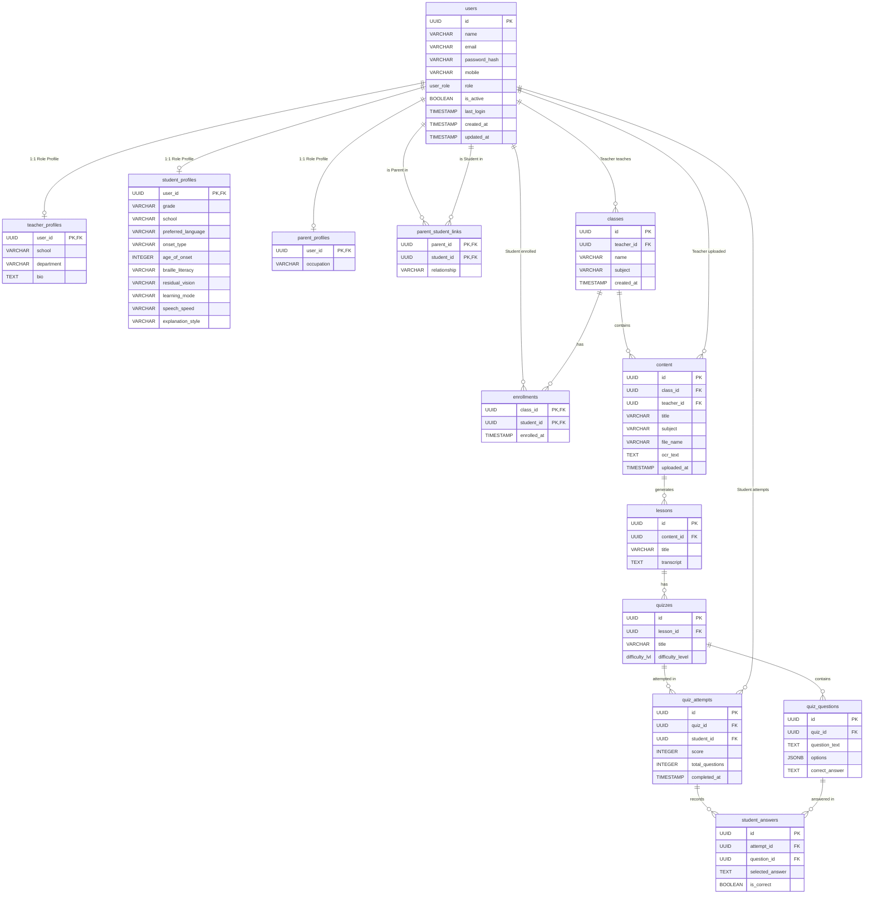

# AI Tutor ER Diagram

Below is the Entity-Relationship (ER) diagram for the newly migrated PostgreSQL schema. It represents the tables, their columns, and the relationships (foreign keys) connecting them.

